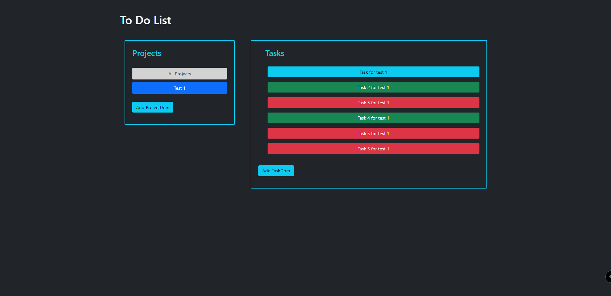

# Javascript To-Do List

> This is a To-Do List Web-App made with Javascript, Bootstrap 5, and Local Storage where the user can create projects and add tasks to that projects. While creating a new task, the user can add the name of the task, a description, a due date, and a priority. Also, the user can edit the tasks or delete them.

# Application Screenshot


## Built With

- HTML
- CSS
- Bootstrap 5
- Javascript
- Local Storage
- Webpack

## Live Demo

You can visit [here](https://alexisbec.github.io/JS-ToDoList/) our app.

## Getting Started

To get a local copy up and running follow these simple example steps:

- Clone this repository with:
```
   https://github.com/alexisbec/JS-ToDoList.git
```
- Open the project folder where the repository was downloaded.
- Install all the Webpack dependencies:
```
   npm install
```
- Compile all the JS files:
```
   npm run build
```
- Open the *index.html* file with your live server.
- Start creating projects and adding tasks.

## Prerequisites

- Web Browser
- Internet connection

### Instructions

1. Click on the *Add Project* button.
2. Choose the name of the project and click the *Create Project* button.
3. Click over the name of the project and then create a task in *Add Task*.
4. Fill the form with the information about the task you want to add and then click *Create Task*.
5. Start doing all your 'todos' or edit the ones that you've created!

## Authors

👤 **Alexisbec**
- Github: [@alexisbec](https://github.com/alexisbec)
- Linkedin: [Alexis Varela](www.linkedin.com/in/alexbec)
- Twitter : [@AlexisV31667779](https://twitter.com/AlexisV31667779)

👤 **Gabriel Suarez**
- Github: [@ginnandjuice](https://github.com/ginnandjuice)
- Twitter: [@fatbaxxter](https://twitter.com/fatbaxxter)
- Linkedin: [Gabriel Suárez](https://www.linkedin.com/in/gabriel-ginn-suarez/)


## 🤝 Contributing

Contributions, issues, and feature requests are welcome!

## Show your support

Give a ⭐️ if you like this project!

## 📝 License

This project is [MIT](https://github.com/alexisbec/JS-ToDoList/blob/development/LICENSE) licensed.